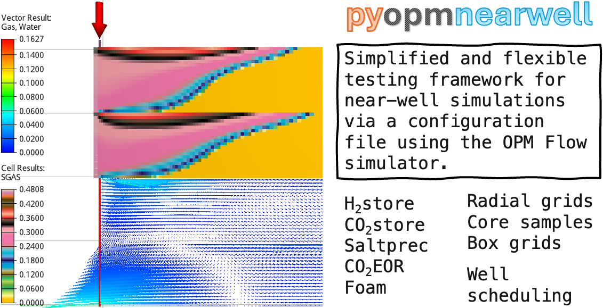

[](https://github.com/cssr-tools/pyopmnearwell/actions/workflows/CI.yml)
<a href="https://www.python.org/"></a>
[](https://github.com/ambv/black)
[](https://www.gnu.org/licenses/gpl-3.0)
[](https://zenodo.org/doi/10.5281/zenodo.10266790)


# pyopmnearwell: A Python framework to simulate near well dynamics using OPM Flow

## Main feature
Simplified and flexible testing framework for near-well simulations via a configuration file using the OPM Flow simulator.

## Installation
You will first need to install
* OPM Flow (https://opm-project.org, Release 2024.10 or current master branches)

To install the _pyopmnearwell_ executable from the development version: 

```bash
pip install git+https://github.com/cssr-tools/pyopmnearwell.git
```

If you are interested in a specific version (e.g., v2024.10) or in modifying the source code, then you can clone the repository and install the Python requirements in a virtual environment with the following commands:

```bash
# Clone the repo
git clone https://github.com/cssr-tools/pyopmnearwell.git
# Get inside the folder
cd pyopmnearwell
# For a specific version (e.g., v2024.10), or skip this step (i.e., edge version)
git checkout v2024.10
# Create virtual environment
python3 -m venv vpyopmnearwell
# Activate virtual environment
source vpyopmnearwell/bin/activate
# Upgrade pip, setuptools, and wheel
pip install --upgrade pip setuptools wheel
# Install the pyopmnearwell package
pip install -e .
# For contributions/testing/linting, install the dev-requirements
pip install -r dev-requirements.txt
``` 

See the [_installation_](https://cssr-tools.github.io/pyopmnearwell/installation.html) for further details on building OPM Flow from the master branches
in Linux, Windows, and macOS, as well as the opm Python package and LaTeX dependencies.

## Running pyopmnearwell
You can run _pyopmnearwell_ as a single command line:
```
pyopmnearwell -i configuration_file.toml
```
Run `pyopmnearwell --help` to see all possible command line 
argument options. Inside the `configuration_file.toml` file you provide the path to the
flow executable and simulation parameters. See the .toml files in the [_examples_](https://github.com/cssr-tools/pyopmnearwell/tree/main/examples),
[_tests/geometries/_](https://github.com/cssr-tools/pyopmnearwell/tree/main/tests/geometries), and [_tests/models/_](https://github.com/cssr-tools/pyopmnearwell/tree/main/tests/models) folders. 

## Getting started
See the [_examples_](https://cssr-tools.github.io/pyopmnearwell/examples.html) in the [_documentation_](https://cssr-tools.github.io/pyopmnearwell/introduction.html).

## Citing
* Landa-Marbán, D. and von Schultzendorff, P.M. 2023. pyopmnearwell: A framework to simulate near well dynamics using OPM Flow. https://doi.org/10.5281/zenodo.10266790.

## Publications
The following is a list of manuscripts in which _pyopmnearwell_ is used:

1. Landa-Marbán, D., Zamani, N., Sandve, T.H., Gasda, S.E., 2024. Impact of Intermittency on Salt Precipitation During CO2 Injection, presented at SPE
Norway Subsurface Conference, Bergen, Norway, April 2024. doi: 10.2118/218477-MS.   
1. von Schultzendorff, P., Sandve, T.H., Kane, B., Landa-Marbán, D., Both, J.W., Nordbotten, J.M., 2024. A Machine-Learned Near-Well Model in OPM Flow, presented at ECMOR 2024, European Association of Geoscientists & Engineers, Sep. 2024, pp. 1–23. doi: 10.3997/2214-4609.202437033.
1. Lliguizaca, J.R., Landa-Marbán, D., Gasda, S.E., Sandve, T.H., Alcorn, Z.P., 2024. Data-Driven Predictions of CO2 EOR Numerical Studies Using Machine Learning in an Open-Source Framework, presented at SPE Norway Subsurface Conference, Bergen, Norway, April 2024. doi: 10.2118/218441-MS.
1. Mushabe, R., Minougou, J.D., Landa-Marbán, D., Kane, B., Sandve, T.H., To appear. Predicting Ultimate Hydrogen Production and Residual Volume during Cyclic Underground Hydrogen Storage in Porous Media using Machine Learning.

## About pyopmnearwell
The pyopmnearwell package is being funded by the [_HPC Simulation Software for the Gigatonne Storage Challenge project_](https://www.norceresearch.no/en/projects/hpc-simulation-software-for-the-gigatonne-storage-challenge) [project number 622059] and [_Center for Sustainable Subsurface Resources (CSSR)_](https://cssr.no) 
[project no. 331841].
Contributions are more than welcome using the fork and pull request approach. 
For a new feature, please request this by raising an issue.
