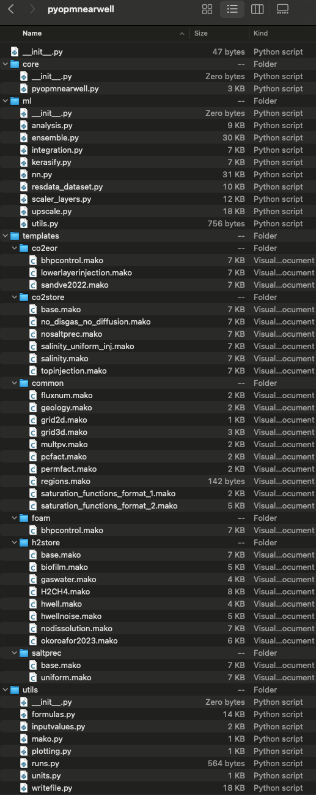

========================
pyopmnearwell Python API
========================

The main script for the **pyopmnearwell** executable is located in the core folder.
The scripts in the utils folder process the input configuration file, creates the geological model, 
write the input files by using the scripts in the templates folder, and execute OPM Flow. The ml folder 
constains scripts used in `this repository <https://github.com/cssr-tools/ML_near_well>`_.

    Files in the pyopmnearwell tool.

.. include:: modules.rst
