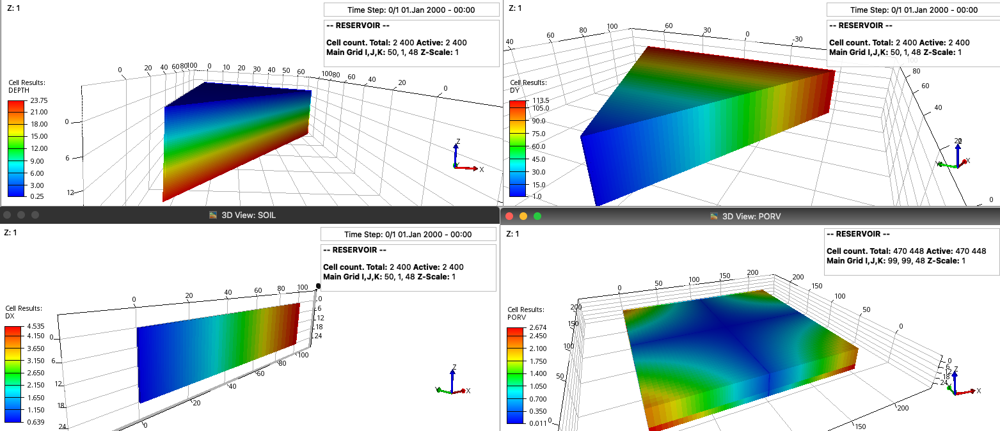
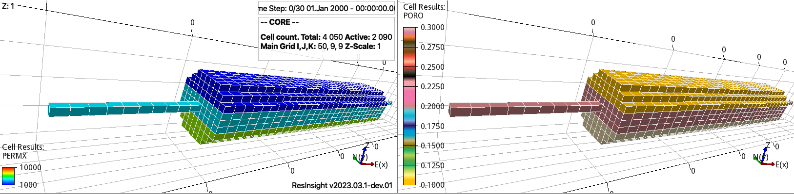

==================
Configuration file
==================

The following configuration file is available in the `examples <https://github.com/cssr-tools/pyopmnearwell/blob/main/examples>`_ folder 
in the GitHub repository as co2.toml and in the :doc:`examples <./examples>` documentation section the simulation results are shown.

The first input parameter in the configuration file is:

.. code-block:: python
    :linenos:

    #Set mpirun, the full path to the flow executable, and simulator flags (except --output-dir)
    flow = "flow --relaxed-max-pv-fraction=0 --enable-opm-rst-file=true --newton-min-iterations=1 --enable-tuning=true" 

If **flow** is not in your path, then write the full path to the executable, as well as adding mpirun
if this is supported in your machine (e.g., flow = "mpirun -np 8 /Users/dmar/Github/opm/build/opm-simulators/bin/flow -\-relaxed-max-pv-fraction=0").

****************************
Reservoir-related parameters
****************************

The following input lines are:

.. code-block:: python
    :linenos:
    :lineno-start: 4

    #Set the model parameters
    model = "co2store" #Model: co2store, co2eor, foam, h2store, or saltprec
    template = "base" #Template file (see src/pyopmnearwell/templates/)
    grid = "cake" #Grid type: cake, radial, core, cartesian2d, coord2d, tensor2d, cartesian, cpg3d, coord3d, or tensor3d
    adim = 60 #Grid cake/radial: theta [degrees]; core: input/output pipe length [m]; cartesian2d, coord2d, tensor2d: width[m]
    xdim = 100 #Length [m] (for cartesian/cpg3d/coord3d/tensor3d, Length=Width=2*xdim)
    xcn = [80] #Number of x-cells [-]; coordinates for grid type coord2d/coord3d [m]; numbers of x-cells for grid type tensor2d/tensor3d [-]
    xfac = 2 #Exponential factor for the telescopic x-gridding (0 to use an equidistant partition)
    diameter = 0.1 #Well diameter [m] 
    pressure = 100 #Pressure [Bar] on the top 
    temperature = [40,40] #Top and bottom temperatures [C]
    initialphase = 0 #Initial phase in the reservoir (0 wetting, 1 non-wetting) 
    pvmult = 1e10 #Pore volume multiplier on the boundary [-] (-1 to ignore; 0 to use well producers instead)
    perforations = [1,5,6] #Activate perforations [-], number of well perforations [-], and length [m]
    hysteresis = "Killough" #Add hysteresis (Killough or Carlson, 0 by default, i.e., no hysteresis)
    zxy = "2-2*mt.cos((2*mt.pi*x/50)) + 10*(x/100)**2" #The function for the reservoir surface

Here we first select the physical model and the corresponding template. To add additional models (e.g., blackoil), one could look at the 
`opm-tests <https://github.com/OPM/opm-tests>`_ decks, convert the necessary input decks and files to mako
templates, add them to the src/pyopmnearwell/templates folder, and extending the Python scripts in the 
src/pyopmnearwell/utils folder. In the following line we select type of grid and the second entry defines the length of the inlet/outlet tubes for the core, 
theta aperture for the radial/cake/coord2d/tensord2d grids, the width of the cells for the cartesian2d grid, or it is ignored for the 3D cartesian grids (the width and number of cells is set equal to 
the ones in the x directions). See/Run the `tests/geometries <https://github.com/cssr-tools/pyopmnearwell/blob/main/tests/geometries>`_ configuration files for these grids.
Then we set the length of the reservoir, as well as the number of grid elements in the x direction (for the y/theta direction we use the 'adim' variable 
with exception to the core/3D grids where the width and number of cells is set equal to the ones in the z/x directions). The xfac entry defines the exponential factor for the telescopic serie used to generate the x partition (if 
set to 0 then an equidistance partition is generated). 

    Four different grids by setting the line 'grid' and 'adim' to 'radial' '36' (top left, showing the depth), 'cake' '60' (top right, showing the y-direction cell size), 
    'cartesian2d' '1' (bottom left, showing the x-direction cell size), and 'cartesian' (bottom right, showing the cell pore volume).

    Example of core geometry (generated by running the examples/h2core.toml configuration file).

We then define additional parameters for the reservoir properties, as described in each configuration file.

***********************
Rock-related parameters
***********************
The following entries define the rock related parameters:

.. code-block:: python
    :linenos:
    :lineno-start: 21

    #Set the saturation functions
    krw = "krw * ((sw - swi) / (1.0 - sni -swi)) ** nkrw"        #Wetting rel perm saturation function [-]
    krn = "krn * ((1.0 - sw - sni) / (1.0 - sni - swi)) ** nkrn" #Non-wetting rel perm saturation function [-]
    pcap = "pen * ((sw - swi) / (1.0 - swi)) ** (-(1.0 / npen))" #Capillary pressure saturation function [Bar]

In this example we consider properties for the sands number 2 to 5 as described in the 
`11th SPE CSP <https://www.spe.org/en/csp/>`_:

.. code-block:: python
    :linenos:
    :lineno-start: 26

    #Properties sat functions: 1) swi [-], 2) sni [-], 3) krw [-], 4) krn [-], 5) pen [Bar], 6) nkrw [-],
    #7) nkrn [-], 8) npen [-], 9) threshold cP evaluation, 10) ignore swi for cP? (sl* for cplog)
    #11) npoints [-] (entry per layer, if hysteresis, additional entries per layer)
    safu = [[0.14,0.1,1,1,8655e-5,2,2,2,1e-4,0,10000],
    [0.12,0.1,1,1,6120e-5,2,2,2,1e-4,0,10000],
    [0.12,0.1,1,1,3871e-5,2,2,2,1e-4,0,10000],
    [0.12,0.1,1,1,3060e-5,2,2,2,1e-4,0,10000],
    [0,0,1,1,0,1,1,1,1e-4,0,10000],
    [0.14,0.2,1,1,8655e-5,2,3,2,1e-4,0,10000],
    [0.12,0.2,1,1,6120e-5,2,3,2,1e-4,0,10000],
    [0.12,0.2,1,1,3871e-5,2,3,2,1e-4,0,10000],
    [0.12,0.2,1,1,3060e-5,2,3,2,1e-4,0,10000],
    [0,0,1,1,0,1,1,1,1e-4,0,10000]]

Since the 'activate perforations option' is set to 1, then we add an extra line after the 4 rock properties
to define the ones in the perforations (Line 33). Since the hysteresis option is activated, then the 
imbibition saturation functions are defined by adding as many additional lines as number of rocks (+1
if the perforations are activated, lines 34 to 38 in this example).

.. note::

    The hysteresis is activated for krn and pcap, no for krw. 

Now for the rock properties:

.. code-block:: python
    :linenos:
    :lineno-start: 40

    #Properties rock: 1) Kxy [mD], 2) Kz [mD], 3) phi [-], 4) thickness [m], and 5) no cells in the z dir [-] (entry per layer)
    rock = [[101.324,10.1324,0.2,6,6],
    [202.650,20.2650,0.2,6,6],
    [506.625,50.6625,0.2,6,6],
    [1013.25,101.325,0.25,6,6],
    [2013.25,201.325,0.45]]

As seen from the previous values, the finnest sand corresponds to the top one and it gets coarser
towards the bottom. The last two entries define the z size of the layer and number of cells, 
while for the perforations these have the thickness of one single cell.

***********************
Well-related parameters
***********************

Now we proceed to define the schedule for the injection well. Here the injection well is located from the
top to the bottom on the left side of the domain and the injection is given as kg/day:  

.. code-block:: python
    :linenos:
    :lineno-start: 47

    #Define the injection values (entry per change in the schedule): 
    #1) injection time [d], 2) time step size to write results [d],
    #3) fluid (0 wetting, 1 non-wetting), 4) injection rates [kg/day].
    #If --enable-tuning=1, then 5) for TUNING values as described in the OPM manual.
    inj = [[7,1e-1,1,57611.52,"1* 1e-2"],
    [7,1e-1,0,57611.52,"1* 5e-2"],
    [7,1e-1,1,57611.52,"1* 5e-2"]]

Here CO2 (non-wetting phase) is injected for seven days printing the results 70 times and limmiting the time step
to 1e-2 days, after water (wetting phase) is injected for the same period at the same mass rate but limiting the time step 
to a higher value of 5e-2 days, and finally CO2 is reinjected for the same period.

.. note::
    If tuning is enabled by the OPM flag **-\-enable-tuning**, then the TUNING keywords are added to the deck, see the OPM Flow manual for the definitions of all 
    34 different options and their default values. To set these values to avoid using the default values, then one can add per injection line in the configuration file a string with the corresponding values, e.g., to set  
    maximum time steps per injection periods as in the example above (the first value is defaulted (1*), and the second entry corresponds to TSMAXZ). If you do not want to 
    use TUNING; then do not add the flag **-\-enable-tuning**, and do not add the string values, e.g., for the previous injection schedule:

    .. code-block:: python

        inj = [[7,1e-1,1,57611.52],
        [7,1e-1,0,57611.52],
        [7,1e-1,1,57611.52]]

    See `this configuration file <https://github.com/OPM/pyopmspe11/blob/main/examples/spe11c.txt>`_ for an example setting more TUNING values, where entries are given for the three 
    different records (lines) of the TUNING keyword. In practice, TUNING helps to speed up simulations, e.g., to limit the time step for periods with higher injection rates, while relaxing it 
    for periods where the wells are shut.

*********************
Additional parameters
*********************

For different models than the co2store, new variables are used from the ones explained here. Then, in each of the 
configuration files, a short description of the variable is added, e.g., for the saltprec model, then the poro-perm 
relationship and the parameters per different facies can be set, see `saltprec.toml <https://github.com/cssr-tools/pyopmnearwell/blob/main/examples/saltprec.toml>`_.