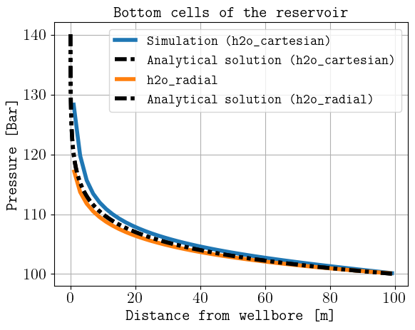
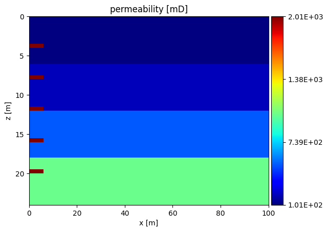
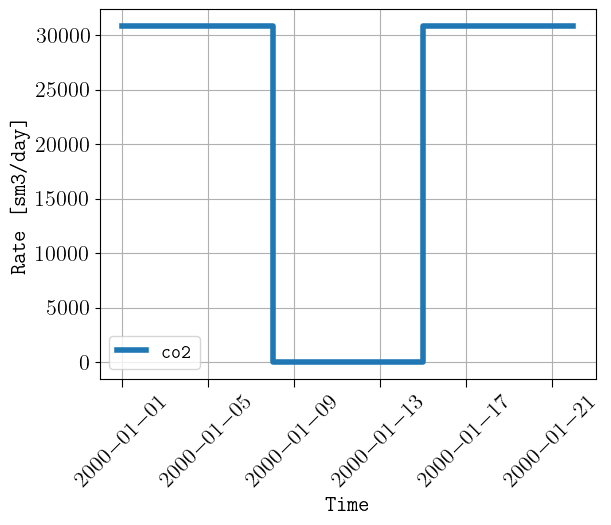
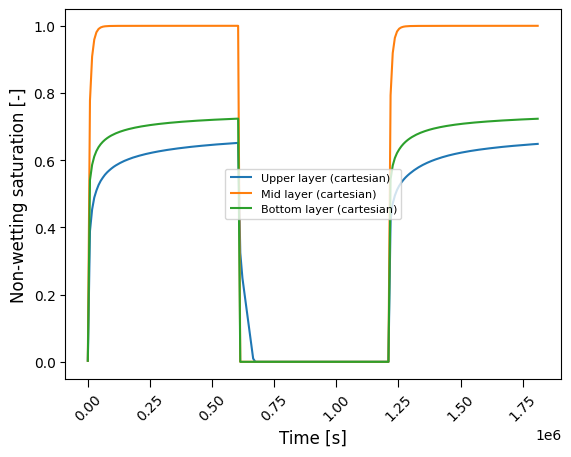

********
Examples
********

Water injection
---------------
In this example we consider the configuration file 'h2o.txt' available in the 
examples folder (`link to the file <https://github.com/daavid00/pyopmnearwell/blob/main/examples/h2o.txt>`_), where
the co2store model is used and only water is injected in a radial grid.

If the generated files are to be saved in a folder called 'h2o_radial', then this is achieved by the following command:

.. code-block:: bash

    pyopmnearwell -i h2o.txt -o h2o_radial

We change the grid to a 3D catesian grid:

.. code-block:: python
    :linenos:
    :lineno-start: 6

    cartesian 1  #Grid type (core/radial/cake/cartesian2d/cartesian/cpg3d/coord2d/coord3d/tensor2d/tensor3d) and size (input/output pipe length[m]/theta[in degrees]/theta[in degrees]/width[m]/anynumber(the y size is set equal to the x one))

and increase the injection rate 6 times (this to be comparable since the radial grid has an angle of 60).

.. code-block:: python
    :linenos:
    :lineno-start: 32

    1e-1 1e-1 5e-2 0 360000

We run again the configuration file and save it in a different folder:

.. code-block:: bash

    pyopmnearwell -i h2o.txt -o h2o_cartesian

To compare the results in the radial and cartesian folder, then it is enough to write in the terminal:

.. code-block:: bash

    pyopmnearwell -c compare

The following figure compares the pressure profile for both simulations:

CO2 cyclic injection
--------------------

In this example we consider the configuration file described in the
:doc:`configuration file<./configuration_file>` section, which is available in the 
examples folder as 'co2.txt'.

If the generated files are to be saved in a folder called 'co2', then this is achieved by the following command:

.. code-block:: bash

    pyopmnearwell -i co2.txt -o co2

The execution time was c.a. 20 seconds and the following is an animation using
ResInsight to visualize the gas saturation:

.. figure:: figs/saturation.gif

    Simulation results of the gas saturation.

The following are some of the plots created by the **pyopmnearwell** executable:

    
    Permeability (top), CO2 injection schedule (middle), and saturation values over time on the cells along the well location
    at three different locations (bottom). 
