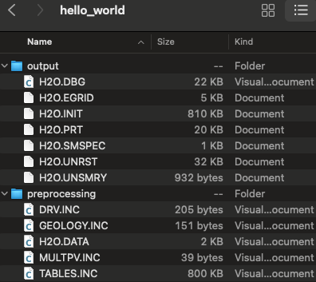

=============
Output folder
=============

The following screenshot shows the generated files in the selected output folder after 
executing **pyopmnearwell**.

    Generated files after executing **pyopmnearwell**.

The deck is generated in the preprocessing folder, and the simulation results are saved in the output folder. 
Then postprocessing tools such as `ResInsight <https://resinsight.org>`_ and `plopm <https://github.com/cssr-tools/plopm>`_ can be used for visualization of the results.
Then after running **pyopmnearwell**, one could modify the generated OPM related files and 
run directly the simulations, e.g., to add different summary variables  
(see the OPM Flow documentation `here <https://opm-project.org/?page_id=955>`_).

.. tip::
    Using the flag **-m single** results in all files being in the same output folder.